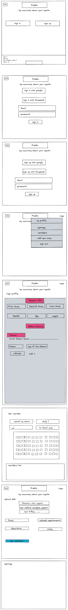

# Predoc

Is a web app application that facilates to make documentation for all your medical cases , so you or your family will be aware of the accurate description of your case .

you can sign up in the application , and store your general data , like : 
 	your name , your age , gender , wieght , 
 	disease  :cornic 
 	          mental 
 	          cancer 
 	          sexual 
 	          
 	
 	
 	last Medical analysis
 
 	
 	 , surgeries ,social status (married or not ) , sport practice , medincines . 
 	 
 	 
 	 
 	 
- the application allows you to record every medical issue ,symptoms  or medicines to facilitate monitoring your medical status . 
 	
 	
 - the application sends has alarm that sends you an email or sms to remind you with your appointments of medicines or visiting the doctor .
 
 
 
 
 
 
 -------------------------------------------------
## User story : 

- As a user , I can sign up and have an account , with basic information about me . 
- As a user , I can upload new medical analysis .
- As a user , I can set a reminder with doctor appointment , or medicines . 
- AS a user , I can create new doctor visit and write all the improtant details in. 
- As a user I can get analysis about myy case depending on my weight , and medical analysis
- As  aser I can invite my doctor to see my medical history without showing information like other doctors names . 
- As a female user , I can record all the details of my periods .
- As a kid user , I can add the vaccines I got or should get . 

 